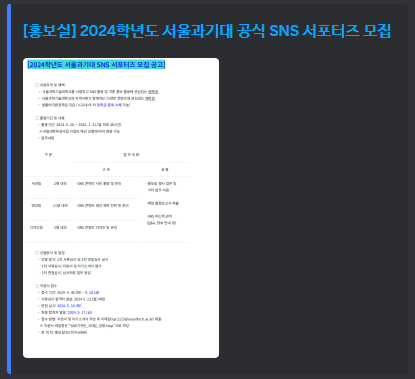
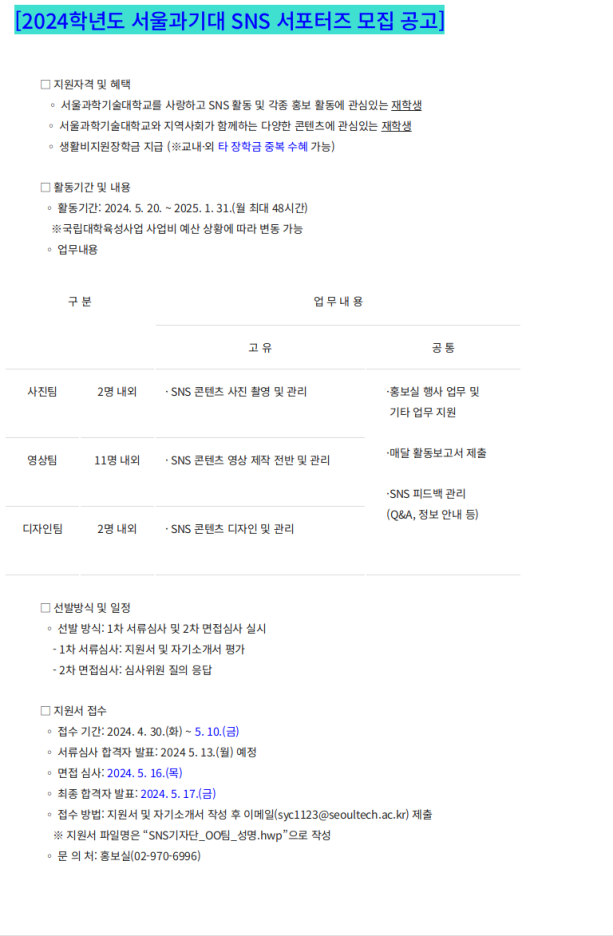

# inhabot
### 포크한 뒤 일부분만 수정한 코드고, 유지보수는 제대로 이루어지지 않을 확률이 높은 프로젝트입니다.
## 인하대 컴퓨터공학과 공지알림 디스코드 봇
이 프로젝트는 인하대학교 컴퓨터공학과 학생들을 위한 공지 알리미 디스코드 봇입니다.

인하대학교 컴퓨터공학과 공지사항을 1시간 주기로 크롤링하여 새로 올라온 공지글의 이미지를 게시글의 링크와 함께 임베드의 형태로 전송합니다. 임베드의 이미지를 클릭하여 확대한 이미지를 볼 수 있습니다.

\

## HOW TO USE
### ※ 프로그램이 불안정하여 오작동을 일으킬 우려가 있으며, 이로 인해 사용에 불편을 야기할 수 있습니다. ※
1. 공지 알림을 받을 채널에서 `/addchannel` 명령어를 사용하여 공지채널을 지정해주세요.
1. 1시간 주기로 새로 올라오거나 제목이 변경된 게시글에 대하여 알림을 보내드립니다.
1. `/deletechannel` 명령어를 통해 해당 채널을 공지 채널에서 제외시킬 수 있습니다.
1. 명령어가 제대로 작동하지 않거나, 오작동을 일으키는 경우에는 Issue를 제기해주세요.

## 봇 운영하기
- go를 처음 사용하신다면, 코드를 작성 및 실행하는 디렉토리에서 `go mod init` 명령어를 통해 초기화를 해주세요.
1. `go get github.com/Firo_SF/inhabot@latest` 명령어를 통해 패키지를 설치해주세요.
2. 코드에서 `"github.com/Firo_SF/inhabot"`를 import 해주세요.
3. `inhabot.Discordbot(Token)`함수를 통해 봇을 실행할 수 있습니다.

### 위 내용은 작동을 보장하지 않음.
